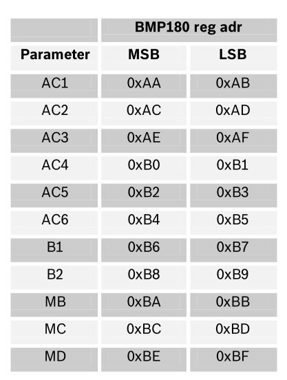
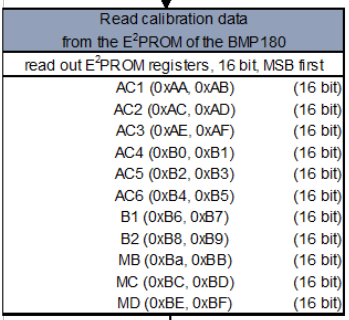
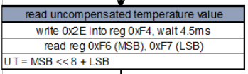
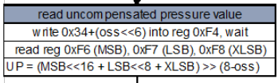
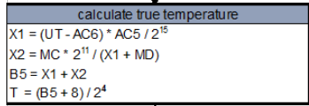
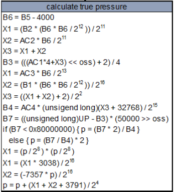
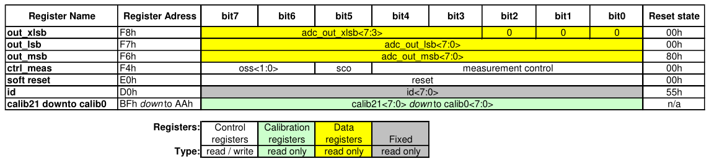
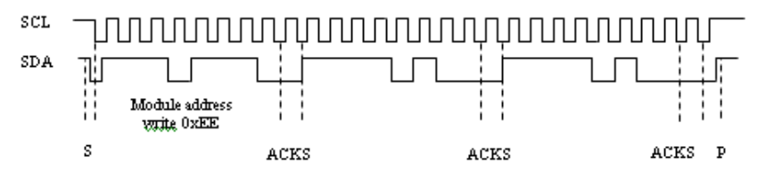
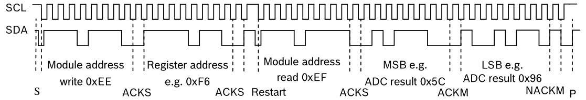

# BMP180 Notes

------

## General Description

The BMP180 is designed to be connected directly to a microcontroller of a mobile device via the I2C bus. The pressure and temperature data has to be compensated by the calibration data of the E2PROM of the BMP180.

The BMP180 consists of a piezo-resistive sensor, an analog to digital converter and a control unit with E2PROM and a serial I2C interface. The BMP180 delivers the uncompensated value of pressure and temperature. The E2PROM has stored 176 bit of individual calibration data. This is used to compensate offset, temperature dependence and other parameters of the sensor.

BMP180 can measure:

- **UP** = uncompensated pressure data (16 to 19 bit)
- **UT** = uncompensated temperature data (16 bit)

------

## Measurement of pressure and temperature

The microcontroller sends a start sequence to start a pressure or temperature measurement. After converting time, the result value (UP or UT, respectively) can be read via the I2C interface. For calculating temperature in °C and pressure in hPa, the calibration data has to be used. These constants can be read out from the BMP180 **E2PROM** via the I2C interface at software initialization.

------

## Calibration coefficients

The 176 bit E2PROM is partitioned in 11 words of 16 bit each. These contain 11 calibration coefficients. Every sensor module has individual coefficients. Before the first calculation of temperature and pressure, the master reads out the E2PROM data. The data communication can be checked by checking that none of the words has the value 0 or 0xFFFF.

------

## Calculating pressure and temperature

1. Read calibration coefficients from EEPROM

   

2. Read uncompensated temperature

   

3. Read uncompensated pressure

   

4. Calculate true temperature

   

5. Calculate true pressure

   

------

## Control Registers

The memory map below shows all externally accessible data registers which are needed to operate BMP180. The left columns show the memory addresses. The columns in the middle depict the content of each register bit. The colors of the bits indicate whether they are read-only, write-only or read- and writable. The memory is volatile so that the writable content has to be re-written after each power-on.

1. **Measurement control (F4h[4:0])** - Controls measurements. 
   - **0x14** - measure pressure
   - **0x0E** - measure temperature 
2. **Sco (F4h[5])** - Start of conversion. The value of this bit stays “1” during conversion and is reset to “0” after conversion is complete (data registers are filled).
3. **Oss (F4h[7:6])** - Oversampling setting. Controls the oversampling ratio of the pressure measurement 
   - **00b**: single, conversion time (ms) - 4.5
   - **01b**: 2 times, conversion time (ms) - 7.5
   - **10b**: 4 times, conversion time (ms) - 13.5
   - **11b**: 8 times), conversion time (ms) - 25.5
4. **Soft reset (E0h)** - Write only register. If set to **0xB6**, will perform the same sequence as power on reset.
5. **Chip-id (D0h)** - This value is fixed to **0x55** and can be used to check whether communication is functioning.

------

## Programming Flow

### Start temperature and pressure measurement

The timing diagrams to start the measurement of the temperature value UT and pressure value UP are shown below. 

1.  The master sends a start condition.
2.  Master sends the device address write (**0xEE**) 
3. Master sends the register address (**0xF4**)
4. Master sends the control register data:
   - **0x2E** - Temperature
   - **0x34** - Pressure (oss = 0)
   - **0x74** - Pressure (oss = 1)
   - **0xB4** - Pressure (oss = 2)
   - **0xF4** - Pressure (oss = 3) 
5. The BMP180 sends an acknowledgement (**ACKS**) every 8 data bits when data is received. 
6. The master sends a stop condition after the last **ACKS**.

### Read A/D conversion result or E2PROM data

To read out the temperature data word UT (16 bit), the pressure data word UP (16 to 19 bit) and the E2PROM data proceed as follows:

1.  The master sends a start condition.
2.  Master sends the device address write command (**0xEE**).
3. Master sends the register address:
   - E2PROM data - **0xAA** to **0xBF**
   - UT or UP - **0xF6** (MSB), **0xF7** (LSB), optionally **0xF8** (XLSB)
4. Master sends a restart condition.
5. Master sends the device address read command (**0xEF**)
6. The BMP180 sends the 8 **MSB**, acknowledged by the master (**ACKM**), 
7. The BMP180 sends the 8 **LSB**,  not acknowledged by the master (**NACKM**).
8. The master sends a stop condition
9. Optionally for ultra high resolution, the **XLSB** register with address **0xF8** can be read to extend the 16 bit word to up to 19 bits