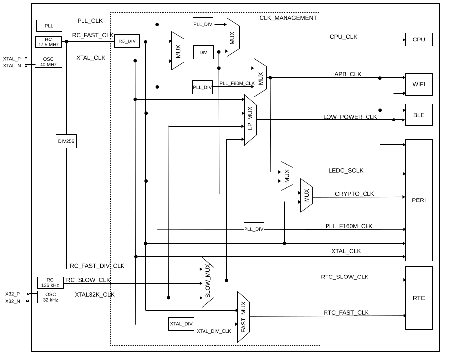

# ESP32-C3 Clocks

------

## Introduction

ESP32-C3 clocks are mainly sourced from oscillator (OSC), RC, and PLL circuit, and then processed by the dividers or selectors, which allows most functional modules to select their working clock according to their power consumption and performance requirements.

------

## CPU Clock

CPU_CLK is the master clock for CPU and it can be as high as **160 MHz** when CPU works in high performance mode. Alternatively, CPU can run at lower frequencies, such as at 2 MHz, to lower power consumption. Default CPU clock is **20 MHz**.

### XTAL_CLK

1. XTAL_CLK is default CPU clock source
2. XTAL_CLK frequency is **40 MHz**
3. Configure **SYSTEM_SOC_CLK_SEL** field in **SYSTEM_SYSCLK_CONF_REG** register to 0
4. Set **SYSTEM_PRE_DIV_CNT** field in **SYSTEM_SYSCLK_CONF_REG** register. XTAL_CLK frequency will be divided by **SYSTEM_PRE_DIV_CNT** + 1. Default **SYSTEM_PRE_DIV_CNT** value is 1.
5. Default CPU clock is **20 MHz** ( XTAL_CLK / (SYSTEM_PRE_DIV_CNT + 1) = 40 MHz / (1 + 1) ). 

### RC_FAST_CLK

1. RC_FAST_CLK frequency in **17.5 MHz**
2. Configure **SYSTEM_SOC_CLK_SEL** field in **SYSTEM_SYSCLK_CONF_REG** register to 2
3. Set **SYSTEM_PRE_DIV_CNT** field in **SYSTEM_SYSCLK_CONF_REG** register. RC_FAST_CLK frequency will be divided by **SYSTEM_PRE_DIV_CNT** + 1. Default **SYSTEM_PRE_DIV_CNT** value is 1

### PLL_CLK

1. Configure **SYSTEM_SOC_CLK_SEL** field in **SYSTEM_SYSCLK_CONF_REG** register to 1

2. PLL_CLK frequency can be **480 MHz** or **320 MHz**. The actual value is configured using **SYSTEM_PLL_FREQ_SEL** field in **SYSTEM_CPU_PER_CONF_REG** register
   - **SYSTEM_PLL_FREQ_SEL** = 0 - 320 MHz
   - **SYSTEM_PLL_FREQ_SEL** = 1 - 480 MHz

3. CPU frequency derived from PLL frequency using divider. Divide value can be configured by **SYSTEM_CPUPERIOD_SEL** in **SYSTEM_CPU_PER_CONF_REG** register. 

   - **SYSTEM_CPUPERIOD_SEL** = 0 - divide by 4 or 6
   - **SYSTEM_CPUPERIOD_SEL** = 0 - divide by 2 or 3

4. CPU can be configured to clocked by **80 MHz** or **160 MHz** frequency:

   - CPU clock is **80 MHz**:

     - PLL clock is 480 MHz (**SYSTEM_PLL_FREQ_SEL** = 1) and divider is 6 (**SYSTEM_CPUPERIOD_SEL** = 0)

     - PLL clock is 320 MHz (**SYSTEM_PLL_FREQ_SEL** = 0) and divider is 4 (**SYSTEM_CPUPERIOD_SEL** = 0)

   - CPU clock is **160 MHz**:

     - PLL clock is 480 MHz (**SYSTEM_PLL_FREQ_SEL** = 1) and divider is 6 (**SYSTEM_CPUPERIOD_SEL** = 1)

     - PLL clock is 320 MHz (**SYSTEM_PLL_FREQ_SEL** = 0) and divider is 4 (**SYSTEM_CPUPERIOD_SEL** = 1)

------

## APB Clock

The frequency of APB_CLK is determined by the clock source of CPU_CLK:

- CPU_CLK clock by **XTAL_CLK**, then APB_CLK is equal **CPU_CLK** ( XTAL_CLK / (SYSTEM_PRE_DIV_CNT + 1) )
- CPU_CLK clock by **RC_FAST_CLK**, then APB_CLK is equal **CPU_CLK** ( RC_FAST_CLK / (SYSTEM_PRE_DIV_CNT + 1) )
- CPU_CLK clock by **PLL_CLK**, then APB_CLK is **80 MHz**

------

## RTC Clock

TODO