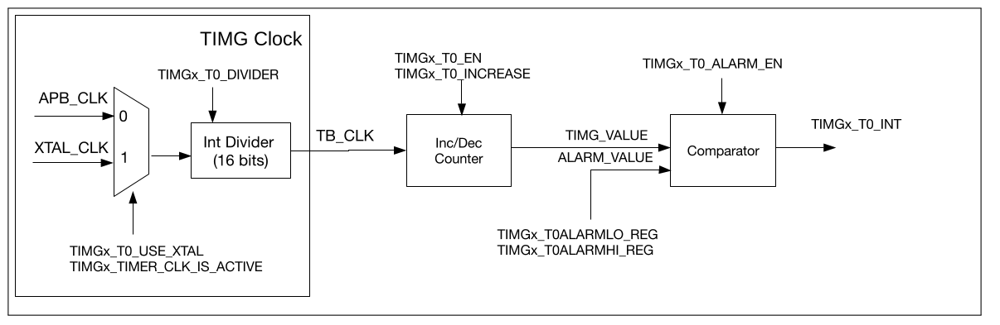

# General Purpose Timers

------

## Introduction

General purpose timers can be used to precisely time an interval, trigger an interrupt after a particular interval (periodically and aperiodically), or act as a hardware clock. ESP32-C3 chip
contains two timer groups, namely timer group 0 and timer group 1. Each timer group consists of one general purpose timer referred to as T0 and one Main System Watchdog Timer. All general purpose timers are based on 16-bit prescalers and 54-bit auto-reload-capable up-down counters.

------

## Timer Clock

The timer can select between the APB clock (APB_CLK) or external clock (XTAL_CLK).

The clock is then divided by a 16-bit prescaler to generate the time-base counter clock (TB_CLK) used by the time-base counter. Divisor of the prescaler can be 2 ~ 65536. Note that programming value 0 to divisor will result in the divisor being 65536. When the divisor is set to 1, the actual divisor is 2 so the timer counter value represents the half of real time.

------

## Counter

The 54-bit time-base counters are based on TB_CLK and can be configured to increment or decrement.

The time-base counter can be enabled or disabled. When enabled, the time-base counter increments or decrements on each cycle of TB_CLK. When disabled, the time-base counter is essentially frozen.

To read the 54-bit value of the time-base counter, the timer value must be latched to two registers before being read by the CPU.

------

## Alarm generator

A timer can be configured to trigger an alarm when the timer’s current value matches the alarm value. An alarm will cause an interrupt to occur and (optionally) an automatic reload of the timer’s current value.

To avoid alarm being enabled ‘too late’ (i.e. the timer value has already passed the alarm value when the alarm is enabled), the hardware will trigger the alarm immediately if the current timer value is higher than the alarm value (within a defined range) when the up-down counter increments, or lower than the alarm value (within a defined range) when the up-down counter decrements.

**Note**: When an alarm occurs, the **TIMG_Tx_ALARM_EN** field is automatically cleared and no alarm will occur again until the **TIMG_Tx_ALARM_EN** is set next time.

------

## Reload

A timer is reloaded when a timer’s current value is overwritten with a reload value stored in the **TIMG_Tx_LOAD_LO** and **TIMG_Tx_LOAD_HI** fields that correspond to the lower 32-bits and higher 22-bits of the timer’s new value, respectively. 

A reload event can be triggered either by a software instant reload or an auto-reload at alarm.

A software instant reload is triggered by the CPU writing any value to **TIMG_TxLOAD_REG**, which causes the timer’s current value to be instantly reloaded.

An auto-reload at alarm will cause a timer reload when an alarm occurs, thus allowing the timer to continue incrementing or decrementing from the reload value. This is generally useful for resetting the timer’s value when using periodic alarms.

------

## Interrupts

Each timer has its own interrupt line that can be routed to the CPU, and thus each timer group has a total of two interrupt lines. Timers generate level interrupts that must be explicitly cleared by the CPU on each triggering.

Interrupts are triggered after an alarm (or stage timeout for watchdog timers) occurs

------

## Programming model

1. Select clock signal between APB_CLK and XTAL_CLK using **TIMG_Tx_USE_XTAL** field of the **TIMG_TxCONFIG_REG** register. 
   - 1- use XTAL_CLK
   - 0 - use APB_CLK

2. Enable selected clock setting **TIMG_TIMER_CLK_IS_ACTIVE** field of the **TIMG_REGCLK_REG**
3. Set the prescaler value. Configure the **TIMG_Tx_DIVIDER** field in **TIMG_TxCONFIG_REG** register. Then toggle **TIMG_Tx_DIVIDER_RST** bit in **TIMG_TxCONFIG_REG** to reset prescaler. Note: when set prescaler **TIMG_Tx_EN** bit in **TIMG_TxCONFIG_REG** should be cleared.
4. Select increment or decrement mode using **TIMG_Tx_INCREASE** field in **TIMG_TxCONFIG_REG**
   - 1 - increment
   - 0 - decrement

5. Configure alarm value by using **TIMG_TxALARMLO_REG** (lower 32 bits) and **TIMG_TxALARMHI_REG** (high 22 bits)
6. Enable alarm by setting **TIMG_Tx_ALARM_EN** field in **TIMG_TxCONFIG_REG** register
7. If needed configure reload value using **TIMG_Tx_LOAD_LO** and **TIMG_Tx_LOAD_HI** registers
8. If needed write any value to **TIMG_TxLOAD_REG** to trigger reload 
9. If needed enable auto-reload at alarm by setting  **TIMG_Tx_AUTORELOAD** in **TIMG_TxCONFIG_REG** register

10. If needed enable interrupt using **TIMG_Tx_INT_ENA** in **TIMG_INT_ENA_TIMERS_REG** register
11. Enabled counter setting **TIMG_Tx_EN** field in **TIMG_TxCONFIG_REG** register 
12. Read interrupt status or raw interrupt value using **TIMG_T0_INT_ST** in **TIMG_INT_ST_TIMERS_REG** and **TIMG_T0_INT_RAW** in **TIMG_INT_RAW_TIMERS_REG**
13. Clear interrupt by setting its corresponding bit to 1 **TIMG_T0_INT_CLR** bit in **TIMG_INT_CLR_TIMERS_REG** register
14. Read counter value by writing any value to the **TIMG_TxUPDATE_REG**. When **TIMG_TxUPDATE_REG** register is cleared counter value can be read from  **TIMG_TxLO_REG** (lower 32 bits) and **TIMG_TxHI_REG** (upper 22 bits) registers

