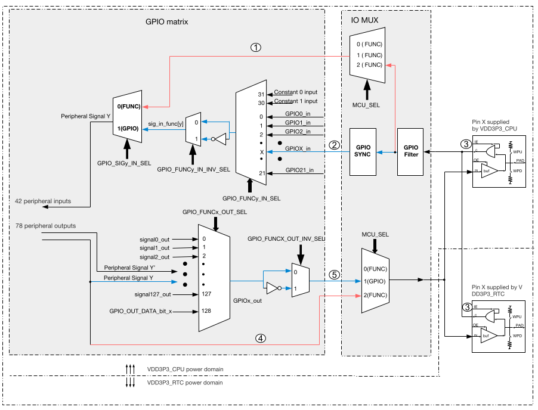
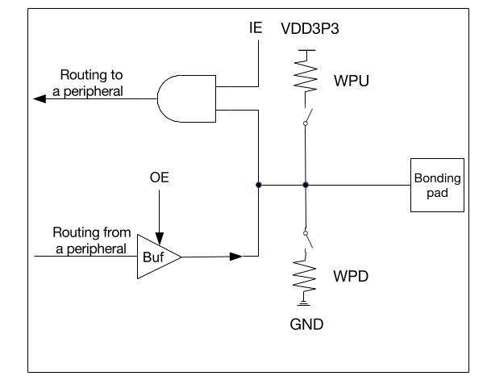
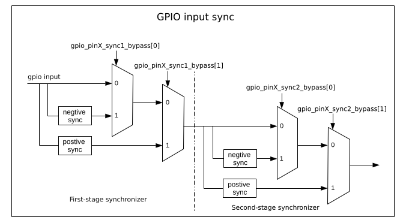
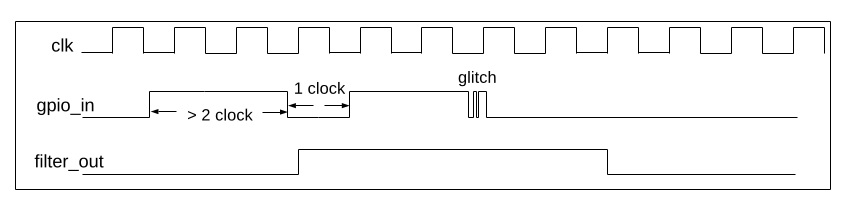

# ESP-C3 GPIO

------

ESP-C3 GPIO system consists from three parts:

- PAD Structure
- IO MUX
- GPIO Matrix

From software point GPIO System configured through two groups of GPIO register:

- GPIO Registers
- IO MUX Registers

------

## Data Registers

- Input data - can be read from **GPIO_IN_REG** register.
- Output data - cam be write using **GPIO_OUT_REG** register. Individual bit can be set and clear using **GPIO_OUT_W1TS** and **GPIO_OUT_W1TC** registers. 

------

## PAD Structure Registers

PAD Structure is GPIO frontend part. It has following configurations:

- Weak Pull Up - 45 kOhm resistor. Configured in **IO_MUX_GPIOn_REG** register in **IO_MUX_GPIOn_FUN_WPU** field. 
- Weak Pull Down - 45 kOhm resistor. Configured in **IO_MUX_GPIOn_REG** register in **IO_MUX_GPIOn_FUN_WPD** field. 
- Input Enable - If disabled input is always zero because of AND gate. Configured in **IO_MUX_GPIOn_REG** register in **IO_MUX_GPIOn_FUN_IE** field. 
- Output Enable - If disabled output in third state because of tree-state buffer. Configured using **GPIO_ENABLE_REG** register. Individual bit can be set and clear using **GPIO_ENABLE_W1TS** and **GPIO_ENABLE_W1TC** registers. 
- Driver Strength - select output current maximum value in mA. Configured in **IO_MUX_GPIOn_REG** register in **IO_MUX_GPIOn_FUN_DRV** field. 
- Open drain - TODO

------

## IO MUX

IO MUX is used to directly connect some peripheral to GPIO PAD Structure. In this part input signal also filtered and synchronized.

### Input synchronization 

The signals will be synchronized to the APB bus clock by GPIO SYNC hardware, then go to GPIO matrix. This synchronization applies to all GPIO matrix signals but does not apply when using the IO MUX.

Synchronization done using to registers, each can be configured for rising or falling edge clock or can be bypassed.

Synchronization configured in **GPIO_PINn_REG** register in fields **GPIO_PINn_SYNC1_BYPASS** and **GPIO_PINn_SYNC2_BYPASS**.

### Input filter

Optionally filter for pin input signals can be enabled. Only the signals with a valid width of more than two clock cycles can be sampled.

Filter can be enabled in **IO_MUX_GPIOn_REG** register using **IO_MUX_GPIOn_FILTER_EN** field .

### Input and Output Multiplexer

Input and output signal can be connected through GPIO Matrix or Directly from peripheral. Input signal can also be routed to analog peripheral. IO MUX is used to select signal source.

IO MUX  can be configured in **IO_MUX_GPIOn_REG** register in **IO_MUX_GPIOn_MCU_SEL** field.

------

## GPIO Matrix

