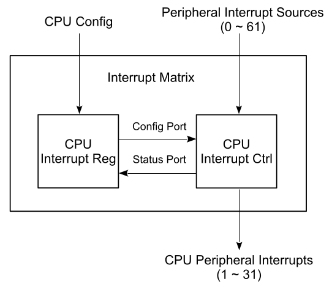

# ESP-C3 Interrupts

------

## Introduction

Each interrupt ID has 5 properties associated with it:
1. Enable State (0-1): Determines if an interrupt is enabled to be captured and serviced by the CPU.
2. Type (0-1): Enables latching the state of an interrupt signal on its rising edge.
3. Priority (1-15): Determines which interrupt, among multiple pending interrupts, the CPU will service first. Interrupts with same priority are statically prioritized by their IDs, lowest ID having highest priority.
4. Pending State (0-1): Reflects the captured state of an enabled and unmasked interrupt signal. A pending interrupt will cause CPU to enter trap if no other pending interrupt has higher priority. A pending interrupt is said to be ’claimed’ if it preempts the CPU and causes it to jump to the corresponding trap vector address. All pending interrupts which are yet to be serviced are termed as ’unclaimed’.
5. Clear State (0-1): Toggling this will clear the pending state of claimed edge-type interrupts only. Pending state of a level type interrupt is unaffected by this and must be cleared from source. Pending state of an unclaimed edge type interrupt can be flushed, if required, by first clearing the corresponding bit in interrupt enable and then toggling same bit in clear register.

------

## CPU Latency Aspects

Whenever any of its registers are modified, the Interrupt Controller enters into transient state, which may take up to 4 cycles for it to settle down into steady state again. During this transient state, the ordering of interrupts may not be predictable, and therefore, a few safety measures need to be taken in software to avoid any synchronization issues.

Also, it must be noted that the Interrupt Controller configuration registers lie in the APB address range, hence any R/W access to these registers may take multiple cycles to complete. In consideration of above mentioned characteristics, users are advised to follow the sequence described below, whenever modifying any of the Interrupt Controller registers:

1. save the state of **MIE** and clear **MIE** to 0
2. read-modify-write one or more Interrupt Controller registers
3. execute **FENCE** instruction to wait for any pending write operations to complete
4. finally, restore the state of **MIE**

------

## Configure interrupts

### Enable Interrupt

By default, interrupts are disabled globally, since the reset value of MIE bit in mstatus is 0. Software must set **MIE**=1 after initialization of the interrupt stack (including setting **mtvec** to the interrupt vector address) is done.

During normal execution, if an interrupt n is to be enabled, the below sequence may be followed:

1. save the state of **MIE** and clear **MIE** to 0
2. depending upon the type of the interrupt (edge/level), set/unset the nth bit of **INTERRUPT_CORE0_CPU_INT_TYPE_REG**
3. set the priority by writing a value to **INTERRUPT_CORE0_CPU_INT_PRI_n_REG** in range 1(lowest) to 15 (highest)
4. set the nth bit of **INTERRUPT_CORE0_CPU_INT_ENABLE_REG**
5. execute **FENCE** instruction
6. restore the state of **MIE**

### Claim Interrupt

1. When one or more interrupts become pending, the CPU acknowledges (claims) the interrupt with the highest priority and jumps to the trap vector address corresponding to the interrupt’s ID. 
2. Software implementation may read **mcause** to infer the type of trap (mcause(31) is 1 for interrupts and 0 for exceptions) and then the ID of
   the interrupt (**mcause**(4-0) gives ID of interrupt or exception). 
3. Upon entering into an ISR, software must toggle the nth bit of **INTERRUPT_CORE0_CPU_INT_CLEAR_REG** if the interrupt is of edge type, or clear the source of the interrupt if it is of level type.
4. Software may also update the value of **INTERRUPT_CORE0_CPU_INT_THRESH_REG** and program **MIE**=1 for allowing higher priority interrupts to preempt the current ISR (nesting), however, before doing so, all the state CSRs must be saved (**mepc**, **mstatus**, **mcause**, etc.) since they will get overwritten due to occurrence of such an interrupt. Later, when exiting the ISR, the values of these CSRs must be restored.
5. Finally, after the execution returns from the ISR back to the trap handler, **MRET** instruction is used to resume normal execution.

### Disable interrupt

If the n interrupt is no longer needed and needs to be disabled, the following sequence may be followed:
1. save the state of **MIE** and clear **MIE** to 0
2. check if the interrupt is pending in **INTERRUPT_CORE0_CPU_INT_EIP_STATUS_REG**
3. set/unset the nth bit of **INTERRUPT_CORE0_CPU_INT_ENABLE_REG**
4. if the interrupt is of edge type and was found to be pending in step 2 above, nth bit of **INTERRUPT_CORE0_CPU_INT_CLEAR_REG** must be toggled, so that its pending status gets flushed
5. execute **FENCE** instruction
6. restore the state of **MIE**

------

## Interrupt Matrix

The interrupt matrix embedded in ESP32-C3 independently routes peripheral interrupt sources to the ESP-RISC-V CPU’s peripheral interrupts, to timely inform CPU to process the coming interrupts.

The ESP32-C3 has 62 peripheral interrupt sources. To map them to 31 CPU interrupts, this interrupt matrix is needed.

------

## Allocate Interrupt Source and Query Status

#### Terms

- **Source_X**: stands for a peripheral interrupt source, wherein X means the number of this interrupt source
- **INTERRUPT_CORE0_SOURCE_X_MAP_REG**: stands for a configuration register for the peripheral interrupt
  source (Source_X)
- **Num_P**: the index of CPU interrupts, can be 1 ~ 31
- **Interrupt_P**: stands for the CPU interrupt numbered as Num_P

#### Allocate one peripheral interrupt source

Setting the corresponding configuration register **INTERRUPT_CORE0_SOURCE_X_MAP_REG** of **Source_X** to **Num_P** allocates this interrupt source to **Interrupt_P**.

#### Allocate multiple peripheral interrupt sources

Setting the corresponding configuration register **INTERRUPT_CORE0_SOURCE_Xn_MAP_REG** of each interrupt source to the same **Num_P** allocates multiple sources to the same **Interrupt_P**. Any of these sources can trigger CPU **Interrupt_P**. When an interrupt signal is generated, CPU should check the interrupt status registers to figure out which peripheral generated the interrupt

#### Disable CPU peripheral interrupt source

Clearing (writing 0) the configuration register **INTERRUPT_CORE0_SOURCE_X_MAP_REG** disables the corresponding interrupt source.

#### Query Current Interrupt Status

Users can query current interrupt status of a peripheral interrupt source by reading the bit value in **INTERRUPT_CORE0_INTR_STATUS_n_REG** (read only). Register stores the status of the interrupt sources. If the bit is 1 here, it means the corresponding source triggered an interrupt

------

## Programming Model

#### Configure Interrupt

1. Save the state of **MIE** and clear **MIE** to 0
2. If needed configure **mtvec** to setup vector table
3. Set interrupt type by configure ID bit in **INTERRUPT_CORE0_CPU_INT_TYPE_REG** register:
   - 0 - level-triggered
   - 1 - edge-triggered
4. Set interrupt priority by **INTERRUPT_CORE0_CPU_PRI_n_MAP** register. The priority here can be 1 (lowest) ~ 15 (highest). If priority is zero then interrupt is disabled
5. Setup interrupt source by **INTERRUPT_CORE0_SOURCE_X_MAP** register. Write interrupt ID to this register
6. Enable interrupt in peripheral
7. Enable interrupt in CPU by setting bit in **INTERRUPT_CORE0_CPU_INT_ENABLE_REG**
8. Set threshold by **INTERRUPT_CORE0_CPU_INT_THRESH_REG** register for interrupt assertion to CPU. Only when the interrupt priority is equal to or higher than this threshold, CPU will respond to this interrupt.
9. Execute **FENCE** instruction
10. Restore the state of **MIE**

#### Claim Interrupt

1. Read **mcause** to check which interrupt is triggered
2. Read **INTERRUPT_CORE0_INTR_STATUS_X_REG** register what source trigger interrupt
3. Clear current interrupt by toggling corresponding bit in **INTERRUPT_CORE0_CPU_INT_CLEAR_REG**
4. Read **INTERRUPT_CORE0_CPU_INT_EIP_STATUS** register to find if any other pending  interrupts 

