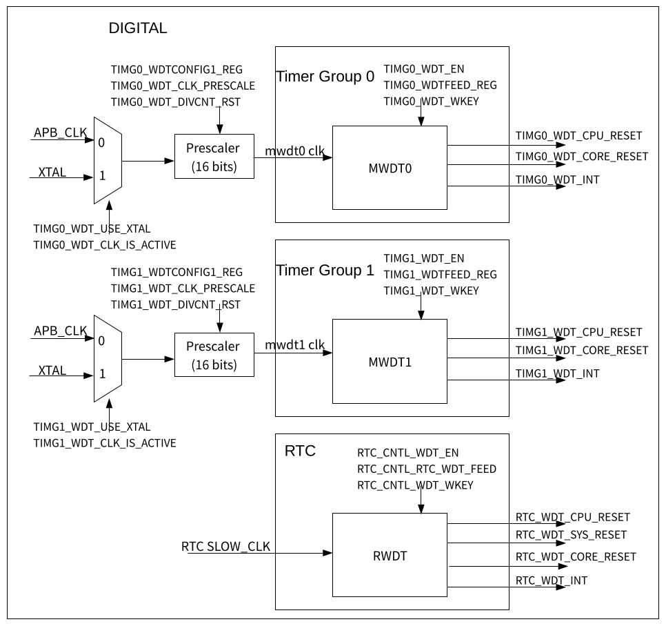

# General Purpose Timers

------

## Introduction

Watchdog timers are hardware timers used to detect and recover from malfunctions. They must be periodically fed (reset) to prevent a timeout. A system/software that is behaving unexpectedly (e.g. is stuck in a software loop or in overdue events) will fail to feed the watchdog thus trigger a watchdog timeout. Therefore, watchdog timers are useful for detecting and handling erroneous system/software behavior.

MWDT supports three timeout actions: interrupt, CPU reset, and core reset, while RWDT supports four timeout actions: interrupt, CPU reset, core reset, and system reset. A timeout value can be set for each stage individually.

**Note:** During the flash boot process, RWDT and the first MWDT in timergroup 0 are enabled automatically in order to detect and recover from booting errors.

------

## Timer Clock

MWDTs can select between the APB clock (APB_CLK) or external clock (XTAL_CLK) as its clock source.

Then the selected clock is divided by a 16-bit configurable prescaler.

------

## Counter

When enabled, the 32-bit counters of each watchdog will increment on each source clock cycle until the timeout value of the current stage is reached (i.e. expiry of the current stage). 

When this occurs, the current counter value is reset to zero and the next stage will become active. If a watchdog timer is fed by software, the timer will return to stage 0 and reset its counter value to zero.

------

## Timeout actions

Timer stages allow for a timer to have a series of different timeout values and corresponding expiry action. When one stage expires, the expiry action is triggered, the counter value is reset to zero, and the next stage becomes active. MWDTs/ RWDT provide four stages (called stages 0 to 3). The watchdog timers will progress through each stage in a loop (i.e. from stage 0 to 3, then back to stage 0).

Upon the expiry of each stage, one of the following expiry actions will be executed:

- Trigger an interrupt: When the stage expires, an interrupt is triggered.
- CPU reset – Reset a CPU core: When the stage expires, the CPU core will be reset.
- Core reset – Reset the main system: When the stage expires, the main system (which includes MWDTs, CPU, and all peripherals) will be reset. The power management unit and RTC peripheral will not be reset.
- Disabled: This stage will have no effects on the system

------

## Programming model

1. Disable write protection to open access to MWDT configuration registers. Write key **0x50D83AA1** to **TIMG_WDT_WKEY** register
2. For first timer after ROM boot initial code disable flash boot protection by clear **TIMG_WDT_FLASHBOOT_MOD_EN** field in **TIMG_WDTCONFIG0_REG** register
3. Select clock signal between APB_CLK and XTAL_CLK using **TIMG_WDT_USE_XTAL** field of the **TIMG_WDTCONFIG0_REG** register. 
   - 1- use XTAL_CLK
   - 0 - use APB_CLK
4. Enable selected clock setting **TIMG_WDT_CLK_IS_ACTIVE** field of the **TIMG_REGCLK_REG**
5. Set the prescaler value. Configure the **TIMG_WDT_CLK_PRESCALE** field in **TIMG_WDTCONFIG1_REG** register. Then toggle **TIMG_WDT_DIVCNT_RST** bit in **TIMG_WDTCONFIG1_REG** to reset prescaler. 
6. Configure timeout value for each of 4 stages by writing values to **TIMG_WDTCONFIGi_REG**, i = 2, 3, 4, 5
7. Configure expiry action of all stages by **TIMG_WDT_STGi**, i = 0,1,2,3 fields in **TIMG_WDTCONFIG0_REG**
8. If needed enable interrupt using **TIMG_WDT_INT_ENA** in **TIMG_INT_ENA_TIMERS_REG** register
9. Enabled counter setting **TIMG_WDT_EN** field in **TIMG_WDTCONFIG0_REG** register 
10. Enable write protection to close access to MWDT configuration registers. Write any value other then key **0x50D83AA1** to **TIMG_WDT_WKEY** register
11. Periodically fed watchdog timer by value to **TIMG_WDTFEED_REG** register
12. Read interrupt status or raw interrupt value using **TIMG_WDT_INT_ST** in **TIMG_INT_ST_TIMERS_REG** and **TIMG_WDT_INT_RAW** in **TIMG_INT_RAW_TIMERS_REG**
13. Clear interrupt by setting its corresponding bit to 1 **TIMG_WDT_INT_CLR** bit in **TIMG_INT_CLR_TIMERS_REG** register

