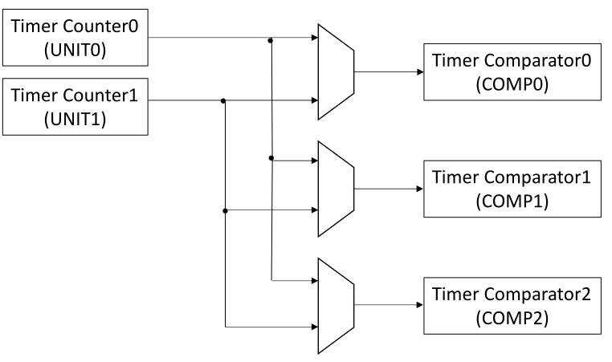

# ESP32-C3 System Timer

------

## Introduction

ESP32-C3 provides a 52-bit timer, which can be used to generate tick interrupts for operating system, or be used as a general timer to generate periodic interrupts or one-time interrupts.

The timer consists of two counters UNIT0 and UNIT1. The count values can be monitored by three comparators COMP0, COMP1 and COMP2.

------

## Clock Source

The counters and comparators are driven using XTAL_CLK. After scaled by a fractional divider, a fXT AL_CLK /3
clock is generated in one count cycle and a fXT AL_CLK /2 clock in another count cycle. The average clock
frequency is fXT AL_CLK /2.5, which is **16 MHz**.

------

## Counters

The system timer has two 52-bit timer counters (TIMER_UNIT 0 and 1). Their counting clock source is a 16 MHz clock. Counter can be stall when CPU in debug mode using SYSTIMER_TIMER_UNITn_CORE0_STALL_EN field.

------

## Comparators

The system timer has three 52-bit comparators, shown as COMPx (x = 0, 1, or 2). The comparators can generate independent interrupts based on different alarm values (t) or alarm periods (δt). Comparators have to modes: target mode and period mode.

In target mode, the lower 32 bits and higher 20 bits of the alarm value (t) are provided by **SYSTIMER_TIMER_TARGETx_LO** and **SYSTIMER_TIMER_TARGETx_HI**. Assuming that current count value is t2 (t2 <= t), an alarm interrupt will be generated when the count value reaches the alarm value (t). **Only one alarm will be generated in target mode!**

In period mode, the alarm period (δt) is provided by the register **SYSTIMER_TARGETx_PERIOD**. Assuming that current count value is t1, when it reaches (t1 + δt), an alarm interrupt will be generated. Another alarm interrupt also will be generated when the count value reaches (t1 + 2*δt). By such way, periodic alarms are generated

------

## Interrupt

Each comparator has one level-type alarm interrupt, named as **SYSTIMER_TARGETx_INT**. Interrupts signal is asserted high when the comparator starts to alarm. Until the interrupt is cleared by software, it remains high.

------

## Programming Model

1. Reset system timer and enable clocks
   - Toggle **SYSTEM_SYSTIMER_RST** in register **SYSTEM_PERIP_RST_EN0_REG**
   - Set **SYSTEM_SYSTIMER_CLK_EN** in register **SYSTEM_PERIP_CLK_EN0_REG** to enable APB_CLK signal to system timer

2. Set counter initail  value

   - Set lower 32 and higher 20 bits of initial count value in registers **SYSTIMER_TIMER_UNITn_LOAD_LO** and **SYSTIMER_TIMER_UNITn_LOAD_HI**

   - Writing 1 to the bit **SYSTIMER_TIMER_UNITn_LOAD** in **SYSTIMER_UNIT0_LOAD_REG** register to trigger a reload event

3. Configure comparators

   - Select counter that will be source comparator using **SYSTIMER_TARGETx_TIMER_UNIT_SEL** field in **SYSTIMER_TARGETx_CONF_REG** register

   - Select target mode (0) or period mode (1) using **SYSTIMER_TARGETx_PERIOD_MODE** field in **SYSTIMER_TARGETx_CONF_REG** register

   - Set compare value
     - For target mode set target 52-bit value in registers **SYSTIMER_TIMER_UNITn_LOAD_LO** (32 bits )and **SYSTIMER_TIMER_UNITn_LOAD_HI** (20 bits)
     - For period mode set period 20-bit value in **SYSTIMER_TARGETx_PERIOD** field in **SYSTIMER_TARGETx_CONF_REG** register

   - Load target or period value by Writing 1 to the bit **SYSTIMER_TIMER_COMPx_LOAD** in **SYSTIMER_COMPx_LOAD_REG** register

4. Enable comparators
   - Set **SYSTIMER_TARGETx_WORK_EN** bit in **SYSTIMER_CONF_REG** register to start compare

5. Enable interrupt
   - Set bit **SYSTIMER_TARGETx_INT_ENA** in **SYSTIMER_INT_ENA_REG** register to enable interrupt

6. Enable counter

   - Set **SYSTIMER_TIMER_UNITn_WORK_EN** bit in **SYSTIMER_CONF_REG** register to enable the counter UNITn in system timer

   - If counter needs to be stalled when CPU is in debuf mode, then set **SYSTIMER_TIMER_UNITn_CORE0_STALL_EN**  bit in **SYSTIMER_CONF_REG** register

7. Processed interrupt

   - Read interrupt status **SYSTIMER_TARGETx_INT_ST** bit in **SYSTIMER_INT_ST_REG** register to check that interrupt is pending. This bit is asserted only if corresponding **SYSTIMER_TARGETx_INT_ENA** bit is set

   - Read raw interrupt status **SYSTIMER_TARGETx_INT_RAW** bit in **SYSTIMER_INT_RAW_REG** register to check, that comparator match is detected. This  bit is always asserted on comparator match, regardless of **SYSTIMER_TARGETx_INT_ENA** bit 

   - Clear **SYSTIMER_TARGETx_INT_ST** and **SYSTIMER_TARGETx_INT_RAW** bit by writing 1 to **SYSTIMER_TARGETx_INT_CLR** bit in **SYSTIMER_INT_CLR_REG** register.

8. Read counter value

   - Writing 1 to **SYSTIMER_TIMER_UNITn_UPDATE** in **SYSTIMER_UNIT0_OP_REG** register will trigger an update event. 

   - Wait until  **SYSTIMER_TIMER_UNITn_VALUE_VALID** is asserted in **SYSTIMER_UNIT0_OP_REG** register

   - The lower 32 and higher 20 bits of current count value will be locked into the registers **SYSTIMER_TIMER_UNITn_VALUE_LO** and **SYSTIMER_TIMER_UNITn_VALUE_HI**

